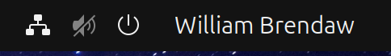
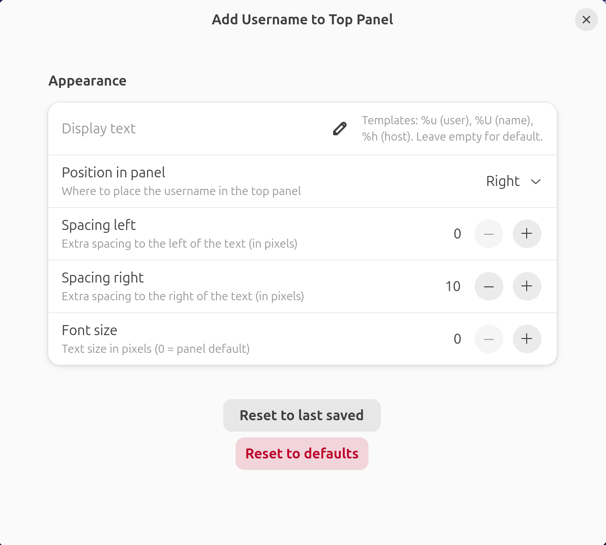

<p align="center">
  
  
  
  
  <a href="https://github.com/brendaw/add-username-toppanel/actions/workflows/ci.yml"></a>
</p>

# Add Username to Top Panel



Simply add your display name to the top panel Quick Settings menu in GNOME Shell.

Visit the [project website](https://autp.brendaw.net) for more details.

## Features

- Displays your display name in the Quick Settings menu of the top panel
- Customizable display text with template variables (`%u` user, `%U` name, `%h` host)
- Configurable position: left, center, or right in the panel
- Adjustable left/right spacing and font size
- Settings apply in real time — no GNOME Shell restart needed
- Reset to last saved settings or to defaults, with a confirmation dialog
- Settings panel accessible from GNOME Extensions preferences
- Compatible with GNOME Shell 45 to 50
- Lightweight with no external dependencies



## Installation

### Via GNOME Extensions

<a href="https://extensions.gnome.org/extension/1108/add-username-to-top-panel/">
  
</a>

Requires [GNOME Shell Integration](https://wiki.gnome.org/Projects/GnomeShellIntegrationForChrome) in your browser.

> ⚠️ The version on GNOME Extensions may lag behind the latest release while the submission is under review. For the newest version, install manually using the steps below.

### From a release ZIP

1. Download the latest `.zip` from the [Releases page](https://github.com/brendaw/add-username-toppanel/releases/latest)

2. Install the extension:

   ```bash
   gnome-extensions install add-username-toppanel@brendaw.com.zip
   ```

3. Log out and back in, then enable the extension:

   ```bash
   gnome-extensions enable add-username-toppanel@brendaw.com
   ```

### From source

1. Clone the repository:

   ```bash
   git clone https://github.com/brendaw/add-username-toppanel.git
   ```

2. Copy the extension files to the extensions folder:

   ```bash
   cp -r add-username-toppanel/src ~/.local/share/gnome-shell/extensions/add-username-toppanel@brendaw.com
   ```

3. Log out and back in, then enable the extension:

   ```bash
   gnome-extensions enable add-username-toppanel@brendaw.com
   ```

## Compatibility

This extension supports GNOME Shell 45 to 50.

> For GNOME Shell 3.12 to 44, use a [legacy release](https://github.com/brendaw/add-username-toppanel/releases) (v2.x or earlier).

## Troubleshooting

### Extension shows "Unknown" instead of my name

The extension uses a fallback cascade: display name → login username → hostname.
If it shows "Unknown", the display name field may be empty in your system.

Check your entry in `/etc/passwd` and fill in the display name field (the GECOS field,
the first comma-separated value after the username) — it will appear after the next
GNOME Shell boot.

You can also set a custom display text in the extension preferences using template variables:
- `%u` — login username
- `%U` — display name
- `%h` — hostname

For other problems, check the [open issues](https://github.com/brendaw/add-username-toppanel/issues) or open a new one.

## Contributing

Contributions are welcome — new features, bug fixes, documentation improvements, and translations.
See [CONTRIBUTING.md](CONTRIBUTING.md) for the development workflow.

The project uses GitHub Actions for automated linting, extension package validation with [shexli](https://pypi.org/project/shexli/), and GitHub Releases on every version tag.

[Issues](https://github.com/brendaw/add-username-toppanel/issues) and
[Pull Requests](https://github.com/brendaw/add-username-toppanel/pulls) are open for your contribution.

## Support

If this extension is useful to you, consider supporting it:

<p>
  <a href="https://github.com/sponsors/brendaw">
    
  </a>
</p>

<p>
  <a href="https://buymeacoffee.com/brendaw">
    
  </a>
</p>

<p>
  <a href="https://ko-fi.com/brendaw">
    
  </a>
</p>

## Contributors

See the [AUTHORS](AUTHORS.md) file for the amazing contributors of this project.

## License

[MIT](LICENSE) - William Brendaw and the contributors - 2016-2026
